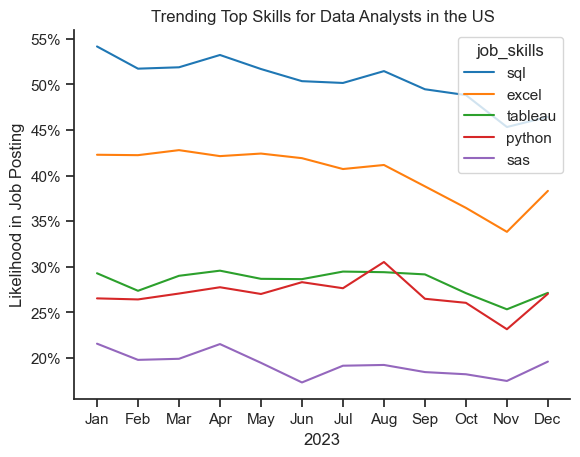
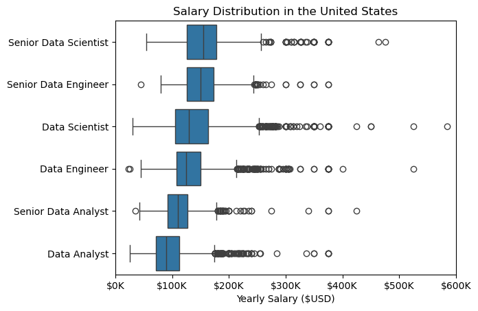
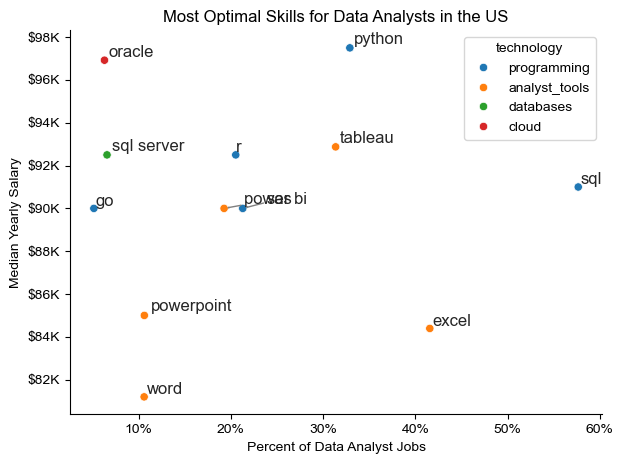

# Python Data Analysis Project – Job Market Insights

##  Project Overview
This project analyzes job market data focusing on **skill demand, skill trends, and salary distribution** in the data-related job sector. The analysis was conducted using Python in Jupyter Notebook.

## The Questions

Below are the questions I want to answer in my project:

1. What are the skills most in demand for the top 3 most popular data roles?
2. How are in-demand skills trending for Data Analysts?
3. How well do jobs and skills pay for Data Analysts?
4. What are the optimal skills for data analysts to learn? (High Demand AND High Paying)
---

##  Project Structure

```
Project Folder
│
├── 2_skill_demand.ipynb
├── 3_skill_trend.ipynb
├── 4_salary_analysis.ipynb
├── README.md
└── images
    ├── skill_demand.png
    ├── skill_trend.png
    └── salary_distribution.png
```

---

##  Dataset

Dataset Source:  
 HuggingFace Dataset – [`lukebarousse/data_jobs`](https://huggingface.co/datasets/lukebarousse/data_jobs)

The dataset includes:

- Job titles  
- Required skills  
- Salary details  
- Job posting dates  
- Job locations  

---

##  Technologies & Libraries Used

```python
pandas
matplotlib
seaborn
datasets
ast
```

### Install Dependencies

```bash
conda install pandas matplotlib seaborn datasets
```

---

##  Data Loading & Cleaning

### Import Libraries

```python
import ast
import seaborn as sns
import pandas as pd
from datasets import load_dataset
import matplotlib.pyplot as plt
```

---

### Load Dataset

```python
dataset = load_dataset('lukebarousse/data_jobs')
df = dataset['train'].to_pandas()
```

---

### Data Cleaning

```python
df['job_posted_date'] = pd.to_datetime(df['job_posted_date'])

df['job_skills'] = df['job_skills'].apply(
    lambda x: ast.literal_eval(x) if pd.notna(x) else x
)
```

---

#  Analysis 1 – Skill Demand

Notebook: [`2_skill_demand.ipynb`](3_project/2_skill_demand.ipynb)

##  Objective
Identify the most demanded skills across job roles in the United States.

---

### Filter United States Jobs

```python
df_US = df[(df['job_country'] == 'United States')]
df_skills = df_US.explode('job_skills')
```

---

### Count Skills by Job Role

```python
df_skills_count = df_skills.groupby(
    ['job_skills','job_title_short']
).size().reset_index(name='skill_count')
```

---

##  Skill Demand Visualization

```python
sns.barplot(
    data=df_skills_count,
    x='skill_count',
    y='job_skills'
)

plt.title('Skill Demand by Job Role')
plt.show()
```

---

### Output Graph


### Insights:

- SQL is the most requested skill for Data Analysts and Data Scientists, with it in over half the job postings for both roles. For Data Engineers, Python is the most sought-after skill, appearing in 68% of job postings.
- Data Engineers require more specialized technical skills (AWS, Azure, Spark) compared to Data Analysts and Data Scientists who are expected to be proficient in more general data management and analysis tools (Excel, Tableau).
- Python is a versatile skill, highly demanded across all three roles, but most prominently for Data Scientists (72%) and Data Engineers (65%).

---

#  Analysis 2 – Skill Trend Over Time

Notebook: [`3_skill_trend.ipynb`](3_project\3_skill_trend.ipynb)

##  Objective
Analyze how skill demand changes monthly for Data Analyst roles.

---

### Filter Data Analyst Jobs in US

```python
df_DA_US = df[
    (df['job_title_short'] == 'Data Analyst') &
    (df['job_country'] == 'United States')
]
```

---

### Extract Posting Month

```python
df_DA_US['job_posted_month_no'] = \
    df_DA_US['job_posted_date'].dt.month
```

---

### Create Pivot Table

```python
df_DA_US_explode = df_DA_US.explode('job_skills')

df_DA_US_pivot = df_DA_US_explode.pivot_table(
    index='job_posted_month_no',
    columns='job_skills',
    aggfunc='size',
    fill_value=0
)
```

---

##  Skill Trend Visualization

```python
df_DA_US_pivot.plot(figsize=(12,6))

plt.title('Monthly Skill Trend for Data Analysts')
plt.xlabel('Month')
plt.ylabel('Job Count')
plt.show()
```

---

### Output Graph



### Insights:
- SQL remains the most consistently demanded skill throughout the year, although it shows a gradual decrease in demand.
- Excel experienced a significant increase in demand starting around September, surpassing both Python and Tableau by the end of the year.
- Both Python and Tableau show relatively stable demand throughout the year with some fluctuations but remain essential skills for data analysts. Power BI, while less demanded compared to the others, shows a slight upward trend towards the year's end.

---

#  Analysis 3 – Salary Distribution

Notebook: [`4_salary_analysis.ipynb`](3_project\4_salary_analysis.ipynb)

##  Objective
Compare salary distributions among top data job roles.

---

### Filter Salary Data

```python
df_US = df[(df['job_country'] == 'United States')]
df_US = df_US.dropna(subset=['salary_year_avg'])
```

---

### Select Top 6 Job Titles

```python
job_titles = df_US['job_title_short'].value_counts().index[:6]

df_US_top6 = df_US[df_US['job_title_short'].isin(job_titles)]
```

---

##  Salary Distribution Visualization

```python
sns.boxplot(
    data=df_US_top6,
    x='salary_year_avg',
    y='job_title_short'
)

plt.title('Salary Distribution in the United States')
plt.xlabel('Yearly Salary ($USD)')
plt.show()
```

---

### Output Graph




#### Insights

- There's a significant variation in salary ranges across different job titles. Senior Data Scientist positions tend to have the highest salary potential, with up to $600K, indicating the high value placed on advanced data skills and experience in the industry.

- Senior Data Engineer and Senior Data Scientist roles show a considerable number of outliers on the higher end of the salary spectrum, suggesting that exceptional skills or circumstances can lead to high pay in these roles. In contrast, Data Analyst roles demonstrate more consistency in salary, with fewer outliers.

- The median salaries increase with the seniority and specialization of the roles. Senior roles (Senior Data Scientist, Senior Data Engineer) not only have higher median salaries but also larger differences in typical salaries, reflecting greater variance in compensation as responsibilities increase.

---
# 4. What are the most optimal skills to learn for Data Analysts?

To identify the most optimal skills to learn ( the ones that are the highest paid and highest in demand) I calculated the percent of skill demand and the median salary of these skills. To easily identify which are the most optimal skills to learn. 

View my notebook with detailed steps here: [5_Optimal_Skills](3_project\5_optimal_skills.ipynb).

#### Visualize Data

```python
from adjustText import adjust_text
import matplotlib.pyplot as plt

plt.scatter(df_DA_skills_high_demand['skill_percent'], df_DA_skills_high_demand['median_salary'])
plt.show()

```

#### Results

    
*A scatter plot visualizing the most optimal skills (high paying & high demand) for data analysts in the US.*

#### Insights

- There's a significant variation in salary ranges across different job titles. Senior Data Scientist positions tend to have the highest salary potential, with up to $600K, indicating the high value placed on advanced data skills and experience in the industry.

- Senior Data Engineer and Senior Data Scientist roles show a considerable number of outliers on the higher end of the salary spectrum, suggesting that exceptional skills or circumstances can lead to high pay in these roles. In contrast, Data Analyst roles demonstrate more consistency in salary, with fewer outliers.

- The median salaries increase with the seniority and specialization of the roles. Senior roles (Senior Data Scientist, Senior Data Engineer) not only have higher median salaries but also larger differences in typical salaries, reflecting greater variance in compensation as responsibilities increase.

### Highest Paid & Most Demanded Skills for Data Analysts

Next, I narrowed my analysis and focused only on data analyst roles. I looked at the highest-paid skills and the most in-demand skills. I used two bar charts to showcase these.

#### Visualize Data

```python

fig, ax = plt.subplots(2, 1)  

# Top 10 Highest Paid Skills for Data Analysts
sns.barplot(data=df_DA_top_pay, x='median', y=df_DA_top_pay.index, hue='median', ax=ax[0], palette='dark:b_r')

# Top 10 Most In-Demand Skills for Data Analystsr')
sns.barplot(data=df_DA_skills, x='median', y=df_DA_skills.index, hue='median', ax=ax[1], palette='light:b')

plt.show()

```

#### Results
Here's the breakdown of the highest-paid & most in-demand skills for data analysts in the US:


*Two separate bar graphs visualizing the highest paid skills and most in-demand skills for data analysts in the US.*

#### Insights:

- The scatter plot shows that most of the `programming` skills (colored blue) tend to cluster at higher salary levels compared to other categories, indicating that programming expertise might offer greater salary benefits within the data analytics field.

- The database skills (colored orange), such as Oracle and SQL Server, are associated with some of the highest salaries among data analyst tools. This indicates a significant demand and valuation for data management and manipulation expertise in the industry.

- Analyst tools (colored green), including Tableau and Power BI, are prevalent in job postings and offer competitive salaries, showing that visualization and data analysis software are crucial for current data roles. This category not only has good salaries but is also versatile across different types of data tasks.


---

# What I Learned

Throughout this project, I deepened my understanding of the data analyst job market and enhanced my technical skills in Python, especially in data manipulation and visualization. Here are a few specific things I learned:

- **Advanced Python Usage**: Utilizing libraries such as Pandas for data manipulation, Seaborn and Matplotlib for data visualization, and other libraries helped me perform complex data analysis tasks more efficiently.
- **Data Cleaning Importance**: I learned that thorough data cleaning and preparation are crucial before any analysis can be conducted, ensuring the accuracy of insights derived from the data.
- **Strategic Skill Analysis**: The project emphasized the importance of aligning one's skills with market demand. Understanding the relationship between skill demand, salary, and job availability allows for more strategic career planning in the tech industry.


# Insights

This project provided several general insights into the data job market for analysts:

- **Skill Demand and Salary Correlation**: There is a clear correlation between the demand for specific skills and the salaries these skills command. Advanced and specialized skills like Python and Oracle often lead to higher salaries.
- **Market Trends**: There are changing trends in skill demand, highlighting the dynamic nature of the data job market. Keeping up with these trends is essential for career growth in data analytics.
- **Economic Value of Skills**: Understanding which skills are both in-demand and well-compensated can guide data analysts in prioritizing learning to maximize their economic returns.

---

# Conclusion

This exploration into the data analyst job market has been incredibly informative, highlighting the critical skills and trends that shape this evolving field. The insights I got enhance my understanding and provide actionable guidance for anyone looking to advance their career in data analytics. As the market continues to change, ongoing analysis will be essential to stay ahead in data analytics. This project is a good foundation for future explorations and underscores the importance of continuous learning and adaptation in the data field.


